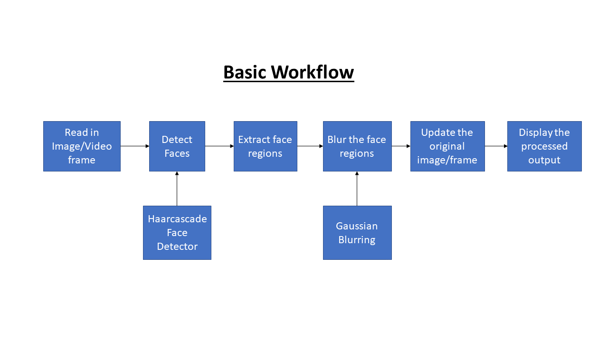

# Blur-Face
A python module to detect and blur faces in image, video or live web-cam feed.

This module leverages the OpenCV functionalities to detect and blur faces in images or videos. The basic workflow of the module is given below:-

  

You can select the modes using the commands as shown.  

For inference on images:-  
`python face_blur.py --image <path to the image file>`  
Eg: `python face_blur.py --image test/test_image.jpg`

For inference on videos:-  
`python face_blur.py --video <path to the video file>`  
Eg: `python face_blur.py --video test/test_video.mp4`  

For inference using web-cam:-  
`python face_blur.py`  

For more details on other parameters use `python face_blur.py --help`

## Input

  

## Output

  

## Applications
These are some of the use cases where face blurring is of utmost importance.  
- Identity protection
- Journalism
- Protection of Children (Online Uploads)
- Dataset Curation and Distribution

## Notes:

Do note that this cannot perform seamlessly in non-ideal conditions such as low-lighting and close proximity of faces etc. But, this is can be improved by using better face detectors that are based on deep learning approaches.
